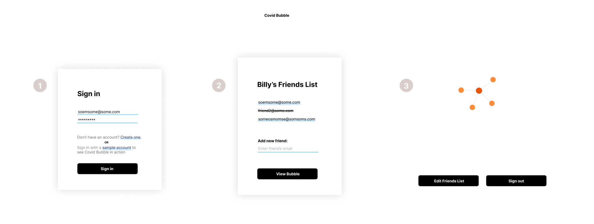

# Covid Bubble

## About Project
Try Covid bubble [here](https://covid-bubble-app.onrender.com/)!

Covid Bubble is a web application built with Python, Flask, React, and MongoDB that allows the user to visualize their social bubbles through a force directed graph. This includes a login/sign-up page, edit friends' list page, and main page to retrieve the account information in a recursive fashion from MongoDB to display every profile that is connected to the user and their close contacts. 


### Development
For local development, change in .env
 `REACT_TEST_APP` to `localhost:5000`
Then in root (covid-bubble/covid-bubble), 
```
pipenv shell 
python api.py
```
This will run the python BE on localhost:5000

Then in react-flask-app, 
``` 
yarn start
```
FE will run on localhost:3000 by default.

Once all changes are goot to be pushed, change the `REACT_TEST_APP` back to onrender.com 
then
```
yarn build
```
Then on render, redeploy.